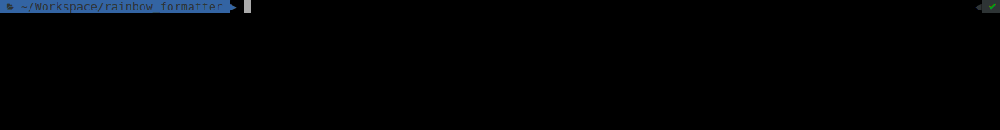
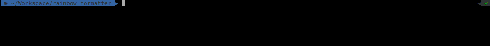

Fully customizable Rainbow trail RSpec formatter.




It simply creates a rainbow trail of test results. It also counts the number of examples as they execute and highlights failed and pending specs.

The rainbow changes colors as it runs!.

Works with RSpec 3.x

Based on [Matt Sears](https://github.com/mattsears/nyan-cat-formatter) Nyan Cat RSpec Formatter

Using  Rainbow
---------------

You can either specify the formatting when using the `rspec` command:

    rspec --format RainbowFormatter

Or add `--format RainbowFormatter` to a `.rspec` file placed in your project's root directory,
so that you won't have to specify the `--format` option everytime you run the command.

#### Only animation formatter .rspec file
```
--color
--format RainbowFormatter
```

#### Music formatter .rspec file
```
--color
--format RainbowMusicFormatter
```

Then run `rspec spec` and enjoy Rainbow formatted text output accompanied by Rainbow song by default!.

All music was composed by [Maria Delfina Ciarrochi](https://soundcloud.com/mariadelfinaciarrochi)

**This currently only works on Mac OS X or on Linux (if you have mpg321 or mpg123 installed).**

#### With running test output
```
--color
--format RainbowVerboseFormatter
```

Displays "running" line with name of test on the first line.


#### Display failed tests immediately
```
--color
--format RainbowInstaFailFormatter
```

Displays failed tests immediately!


### Using with Bundler

To use Rainbow formatter with a project that uses Bundler (Rails or Sinatra f.e.) you need to add Rainbow Cat dependecy to your Gemfile:

```ruby
group :test do
  gem "rainbow_formatter"
end
```

And then run `bundle install`.

Customizing Rainbow
---------------------------------
You can create your own version, with your own song and draw, this way:

```ruby
module YourCustomMode
  def ascii_array
    ['ascci_0','ascii_1']
  end
  def rainbow_mp3
    'your_song_path'
  end
end

RainbowFormatter.configure do |config|
  # Could be a module like above one or a already bundled mode
  config.formatter = YourCustomMode
  # config.formatter = :tina_dream (or any already bundle modes below)
end
```

It's easy to build your array using a string [escape tool](https://www.freeformatter.com/java-dotnet-escape.html#ad-output). Each position of array should be an escaped version of chosen ascii and could be used one after the other as an animation. You can view some examples at /lib/formatter/custom folder. [This](https://www.asciiart.eu) is a good start point to choose some asciis.

#### Already bundled modes:

1. :car
2. :dog
3. :monkey
4. :tina_bike
5. :tina_dream

Contributing
----------

Once you've made your great commits:

1. Fork Rainbow
2. Create a topic branch - git checkout -b my_branch
3. Push to your branch - git push origin my_branch
4. Create a Pull Request from your branch
5. That's it!

Author
----------
[Federico Farina](https://github.com/fedefa)

[Maria Delfina Ciarrochi](https://soundcloud.com/mariadelfinaciarrochi)
